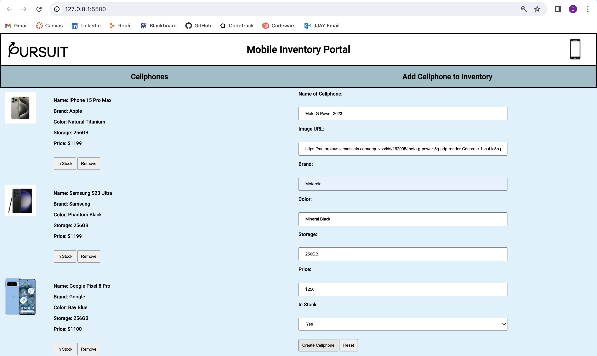
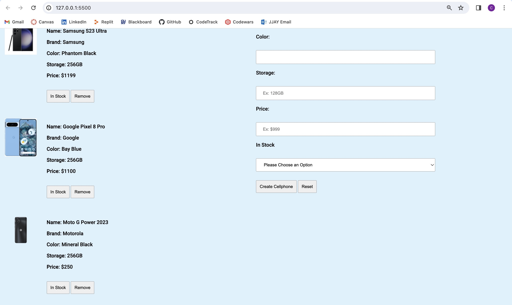
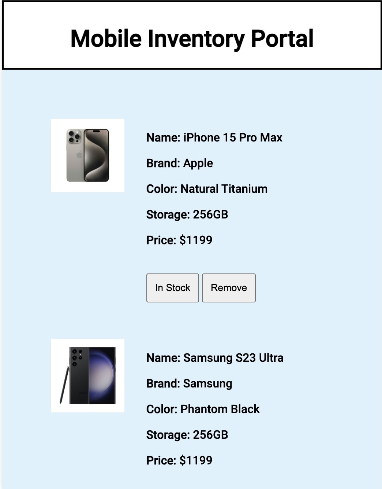
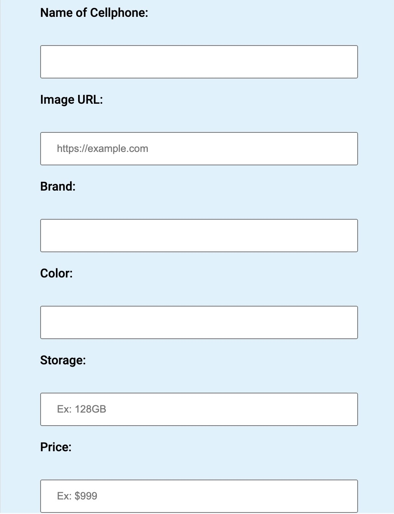

# Pursuit Mobile Inventory Portal

## Introduction
Welcome to Pursuit's Mobile Inventory Website! This web application provides you the user a new experience when it comes to checking the inventory of all the cellphones we offer. A new cellphone coming out and not yet registered in the system? No problem! This web application allows you to do the following:

- View the inventory selection of cellphones
- Update the current stock of a cellphone through a toggle button
- Remove certain cellphones from the inventory selection
- Create new cellphones to add to the inventory selection
- Reset input fields in case you enter the wrong information
- Not to forget it is also mobile friendly!

## Installation

Fork and Clone this repository.

Open the repository in VS Code by using this command in the terminal.
`code .`

## Usage
In this part of the file you will learn exactly how to use the web application to it's full extent.
### Create a Cellphone
When creating a cellphone to add to the inventory you will have to enter certain characterstics regarding the cellphone. For example, we'll be using the:

"Motorola Moto G Power 2023 Mineral Black 256GB"

As seen below just enter the information for the respective field.

Note: Make sure to fill all information because some may be required to fill out. In addition, some inputs may give you advice on how to fill them!

Once all inputs are filled hit the "Create Cellphone" button!

As you can see, the "Motorola Moto G Power 2023 Mineral Black 256GB" has been successfully added to the inventory of the Pursuit Mobile Store.

Also, a reset button was added for the users convenience. In case the user was inputting information that was incorrect the reset button allows them to completely clear out all the input fields and start fresh again.

### View and Update the Inventory

The way this website was designed was to split it into two main columns. One side for the current inventory and the other side is the create a cellphone to add to the inventory.

A feature that was added to update the inventory was the use of a stock toggle button. Whenever the user would need to update the inventory status of a cellphone. By a click of a button the "In Stock" button toggles to "Out of Stock" and vice versa. That way the user is always in control of the inventory status.

Not only this but a remove button feature was also implemented along with each cellphone just like the stock button. The remove button allows the user to completely remove that specific cellphone from the inventory simply by the click of a button. 

### We Are Mobile-Friendly!

Not only do we work just on computers but on tablets and cellphones as well! Check it out: 

If you scroll a little more down you can also see our updated add a cellphone form to fit the page:

